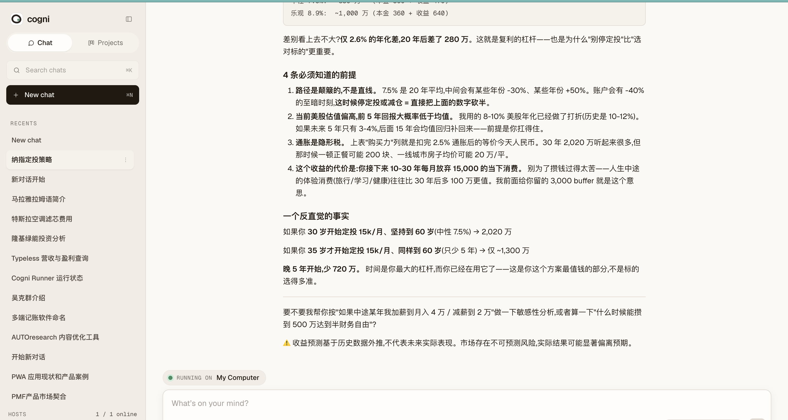
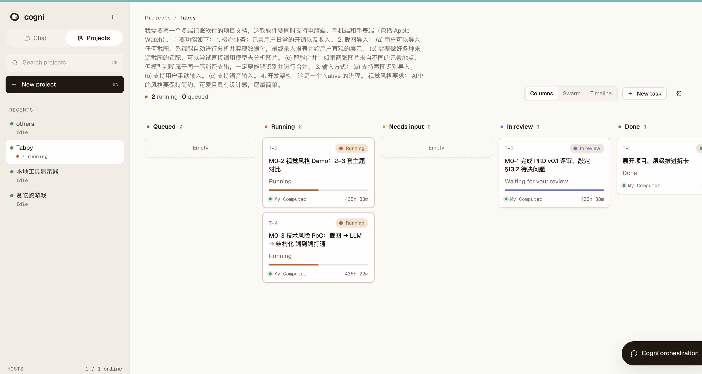
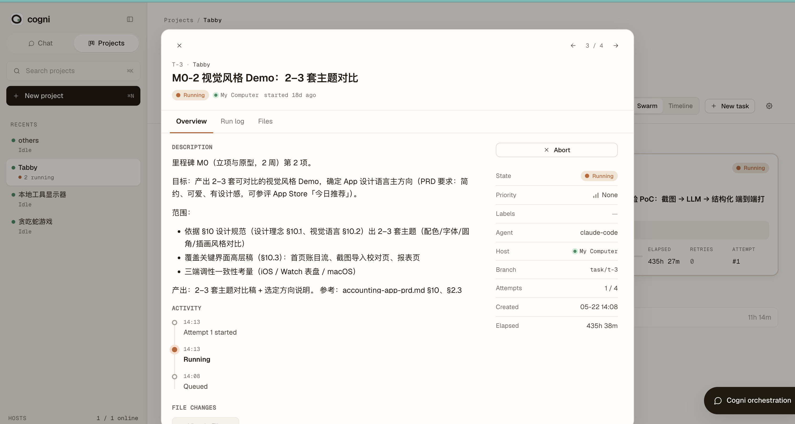

<p align="center">
  
</p>

<h1 align="center">Cogni</h1>

<p align="center">
  <strong>Claude Code, but with a brain in the cloud.</strong><br>
  Open-source AI workspace — your laptop runs the agents, your devices stay in sync.
</p>

<p align="center">
  <a href="LICENSE"></a>
  <a href=".github/workflows/ci.yml"></a>
  <a href="https://github.com/gxPan1006/cogni/stargazers"></a>
</p>

---

## What it does

- 🧠 **Multi-device sync** — chat from web, desktop, or mobile. The agent
  keeps running on your laptop while you switch screens.
- 🛠 **Agent orchestration** — projects, tasks, and a kanban board built on
  top of [Claude Code](https://claude.ai/code). A pluggable runner
  abstraction lets other agent CLIs slot in.
- 🔒 **Self-host** — heavy lifting happens on your own machine. The cloud
  control plane is a small Node + Postgres service you can host on Neon,
  Vercel, Fly, or a $5 VPS.

<p align="center">
  
  
</p>

## Quick start

You'll need [Node 22+](https://nodejs.org), [pnpm
10.33+](https://pnpm.io/installation), a [Neon](https://neon.tech) Postgres
URL, and a Google OAuth client (for sign-in).

```sh
# 1. Clone and install
git clone https://github.com/gxPan1006/cogni.git
cd cogni
corepack enable && corepack prepare pnpm@10.33.0 --activate
pnpm install

# 2. Configure the cloud
cp packages/cloud/.env.example packages/cloud/.env
# Edit .env — fill in DATABASE_URL (Neon), JWT_SECRET, GOOGLE_CLIENT_ID/SECRET

pnpm build
pnpm --filter @cogni/cloud exec drizzle-kit push  # apply schema to Neon

# 3. Run it
pnpm --filter @cogni/cloud dev       # cloud control plane on :8787
pnpm --filter desktop tauri dev      # desktop app — sign in, then chat
```

Full setup (including the Google OAuth redirect URI, optional magic-link
email transport, and PWA push notifications) is in
[`docs/RUNNING.md`](docs/RUNNING.md).

## How it works

```
┌─────────────────────┐      ┌─────────────────────┐      ┌─────────────────────┐
│  Web / Desktop /    │      │   Cloud control     │      │   Runner Host       │
│  Mobile chat UI     │◄────►│   plane             │◄────►│   (your laptop)     │
│                     │  WS  │  (Hono + Neon)      │  WS  │                     │
│  (Tauri, Vite SPA)  │      │                     │      │   ↓                 │
└─────────────────────┘      └─────────────────────┘      │   Claude Code       │
                                                          │   (or other CLI)    │
                                                          └─────────────────────┘
```

The **cloud** owns accounts, projects, and message history. It does not
have an API key for any LLM — it routes work to the **Runner Host**, a
small daemon that registers itself with the cloud over WebSocket and runs
on your own machine. The runner host launches Claude Code (or any other
adapted agent CLI) inside a git worktree of your choosing.

This split means:
- **Your code never leaves your laptop.** The cloud only sees the chat
  messages you send.
- **Multi-device works for free.** Cloud is the source of truth; any
  device you sign in on sees the same conversations and projects.
- **You can swap the agent.** The runner abstraction is `RunnerAdapter` in
  [`packages/contract`](packages/contract/src). Today's adapters are
  Claude Code and an experimental Codex one.

Full design rationale lives in
[`docs/superpowers/specs/2026-05-14-cogni-sp1-spine-design.md`](docs/superpowers/specs/2026-05-14-cogni-sp1-spine-design.md).

## Tech stack

TypeScript end to end. **Cloud:** Hono on Node 22, Neon Postgres,
drizzle-orm, WebSockets via `@hono/node-ws`. **Desktop:** Tauri 2 + React
19. **Web:** React 19 + Vite, deployed as a SPA. **Monorepo:** pnpm
workspaces.

## Project status

- ✅ SP-1 (spine) — cloud + runner-host + desktop chat loop.
- ✅ SP-2 (accounts + multi-device sync + web client).
- ✅ SP-3 (project domain — projects, tasks, kanban, orchestrator).
- 🚧 SP-4 (polish + Windows support).

This is pre-1.0 and ships off `main`. Breaking changes will land in
named "SP-N" sub-projects with design docs in `docs/superpowers/specs/`.

## Contributing

We welcome bug reports, feature ideas, and PRs. See
[`CONTRIBUTING.md`](CONTRIBUTING.md) for how to set up dev and the local
test/lint/typecheck gates.

The codebase has hard rules (TypeScript strict mode, `noUncheckedIndexedAccess`,
`verbatimModuleSyntax`, the runner abstraction boundary, the cloud↔host
protocol contract). [`CLAUDE.md`](CLAUDE.md) documents them — it's written
for AI assistants but reads cleanly for humans too.

## License

MIT — see [`LICENSE`](LICENSE).
